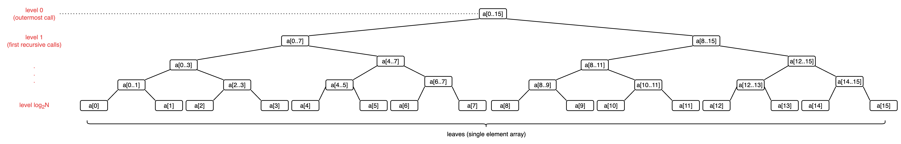

# Mergesort

Mergesort is a canonical divide-and-conquer algorithm in the divide-and-conquer algorithm design paradigm. The idea of divide-and-conquer algorithm design is to break the problem into smaller subproblems, solve subproblems recursively, and finally combine the solutions to the subproblems into one for the original problem.

In mergesort, it breaks the input array in half and then calls mergesort itself on these smaller arrays to sort them recursively. Then, the final **merge** step combine the sorted halves into a single sorted array of original length.

## Pseudocode

### 1. Mergesort

**Input:** array $A$ of $n$ elements.

**Expected output:** elements in array $A$ are sorted in ascending order.

```jsx showLineNumbers
if (n <= 1) return // base case
C := recursively sort 1st half of A // 1st recursive call that sorts the 1st half of A
D := recursively sort 2nd half of A // 2nd recursive call that sorts the 2nd half of A
return Merge(C, D)
```

### 2. Merge

**Input:** sorted arrays $C$ and $D$ (length $n/2$ each).

**Expected output:** sorted array $B$ (length n).

**Simplifying assumption:** n is even.

```jsx showLineNumbers
i := 1  // i is ptr for C
j := 1  // j is ptr for D
for k := 1 to n do
  if C[i] < D[j] then
    B[k] := C[i]  // populate output array B with smaller element amongst C and D
    i := i+1
  else
    B[k] := D[j]
    j := j+1
```

## Implementation

At the stage of merge, the two recursive calls were done and we already have two sorted halves $c$ (A[lo..mid]) and $d$ (A[mid..hi]). The merge step is to traverse the first sorted half from `i = lo` to `mid`, the second sorted half from `j = mid + 1` to `hi`, and the output array $a$ from `k=lo` to `hi`. At each iteration of traversing output array, populate the output array from left to right (A[mid..hi]) with the smallest element among the sorted halves. When one of the halves exhausted, take the rest from the other half.

[Code snippet](https://github.com/Fan-55/Algorithms/blob/main/src/Merge.java)

```jsx showLineNumbers
public class Merge {
  public static void merge(Comparable[] a, int lo, int mid, int hi) {
    // Merge a[lo..mid] with a[mid+1..hi]
    int i = lo;
    int j = mid + 1;
    Comparable[] aux = new Comparable[hi - lo + 1];
    // Copy a[lo..hi] to aux array
    for (int k = lo; k <= hi; k++) {
      aux[k] = a[k];
    }
    // Merge back to a[lo..hi]
    for (int k = lo; k <= hi; k++) {
      if (i > mid) {
        a[k] = aux[j++];
      } else if (j > hi) {
        a[k] = aux[i++];
      } else if (less(aux[i], aux[j])) {
        a[k] = aux[i++];
      } else {
        a[k] = aux[j++];
      }
    }
  }

  public static void sort(Comparable[] a, int lo, int hi) {
    if (hi <= lo) return;
    int mid = lo + (hi - lo) / 2;
    sort(a, lo, mid);
    sort(a, mid + 1, hi);
    // 1st half and 2nd half are already sorted, skip merge
    if (a[mid].compareTo(a[mid + 1]) <= 0) return;
    merge(a, lo, mid, hi);
  }

  public static boolean less(Comparable a, Comparable b) {
    return a.compareTo(b) < 0;
  }
}
```

## Performance

The running time is estimated by the number of lines of code (primitive operation) executed in the implementation of the algorithm.

- **Time complexity**: $O(NlogN)$
- **Space complexity**: $O(N)$

:::tip[Hypothesis]
**Proposition:** For every input array of length $n\ge1$, the mergesort algorithm performs at most $6nlog_{2}n + 6n$ operations, where $log_2$ denotes the base-2 algorithm[^1].

**Proof:**

**1. Running time of merge step**

For the running time of merge step of an array of length $l$, the primitive operations are counted as:

1. Line 4 and 5 each perform an initialization, which will be counted as 2 operations.
2. The 1st for loop executes a total of $l$ times, it performs an assignment operation at each iteration. (*)
3. The 2nd for loop executes a total of $l$ times, each iteration:
    -  Performs a comparison at line 13, 15, or 17
    -  An assignment at line 14, 16, 18 or 20
    -  An increment at line 14, 16, 18 or 20
    -  An increment for the index $k$ at line 12
    -  A comparison of loop index $k$ to upper bound (*)
    - ...(*)

(*) Not counted because it contributes to the constant factor so it depends on the environment (processor, programming language, compiler, etc).

Four primitive operations are performed for each of the $l$ iterations of the loop. To sum up, the merge step performs at most $4l+2$ operations to merge 2 sorted arrays of length $l/2$ each. For $l\ge1$, $4l + 2 \le 4l+2l=6l$, so $6l$ is also a valid upper bound of the number of operations performed by the merge step. **Hence, we use $6l$ as the upper bound of the number of operations at the merge step.**

**2. Recursion tree**



The idea of recursion tree is to write all the work done by a recursive algorithm in a tree structure, with nodes of the tree corresponding to the recursive calls, and the children of a node corresponding to the recursive calls made by that node.

The root of the recursion tree corresponds to the outermost call to mergesort, where the input array length is $n$, and we will call the node `level 0` of the tree. Since each invocation of mergesort creates 2 recursive calls, the tree will be binary (i.e., 2 children per node). `Level 1` has two nodes, corresponding to the two recursive calls made by the root, one of which has the left half of the original array as input and the other has the right half. The process continues until the recursion tree bottoms out with arrays of size 0 or 1 (base case).

**3. Work done per level** 

We can count the total work (number of operations) done by mergesort level by level. At a given `level j`, the number of subproblems (recursive calls or nodes) is $2^j$ while each subproblem works on subarray of length $n/2^j$. Inspecting the mergesort pseudocode, we found that each mergesort call performs only 3 things: two recursive calls and a merge operation. Ignoring the work done by the two recursive calls (and ignoring the fact that recursive calls are operations as well), the work done by a mergesort call is just the work done by merge step, which is bounded by $6l$ where $l$ is the length of input array. Putting everything together:

$ \text{Work done at level j} = \underbrace{\text{Number of subproblems at level j}}_{=2^{j}} \times \underbrace{\text{work done by per level j subproblem}}_{\le6(n/2^j)}$

$\le 2^{j} \times 6(n/2^j)$

$\le 6n$

As we can see, the bound on the work done at a given `level j`, $6n$, is independent of `j`. Each level of the recursion tree contributes the same amount of work because the equilibrium between the two competing forces – the number of subproblems doubles every level while the amount of work performed per subproblem halves every level.

**4. Total work**

For an array of length $n$, the recursion tree has $log_{2}n + 1$ levels (level $0$ through $log_{2}n$, inclusive). We are ignoring the fact that the bottom level of recursive calls hit the base case so merge steps are actually not executed. Let's assume that the recursive calls at bottom level do perform the merge step. Then,

$ \text{Total work done across all levels} = \underbrace{\text{number of levels}}_{=log_{2}n + 1} \times \underbrace{\text{work per level}}_{\le 6n}$

$\le (log_{2}n + 1) \times 6n$

$\le 6nlog_{2}n + 6n$
:::

[^1]: For a positive number $n$, $log_2n$ means the number of times you need to divide n by 2 before the result comes down to one or less.
