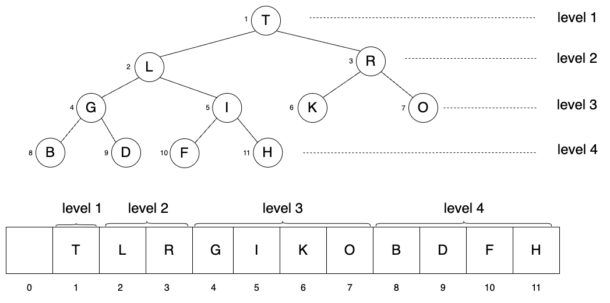
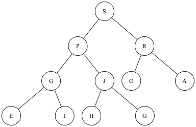
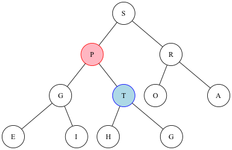
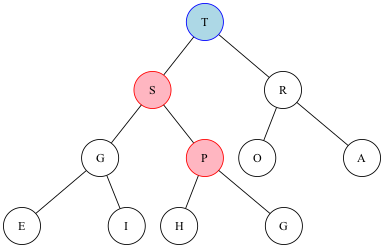
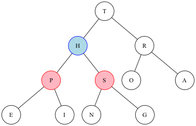
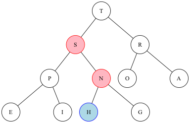

<div style={{ textAlign: 'justify' }}>
# The Heap Data Structure

When fast maximum or minimum computations are required on a dynamically changing set of objects, the heap data structure may be the right choice. The heap can keep track of an evolving set of objects with keys and quickly identify the object with the maximum or minimum key.

**Priority queue** is an abstract data type characterized by the **remove the maximum** (or remove the minimum) and **insert** operations. **Heap** is the data structure that implements priority queue ADT, and it supports efficient `delMax` (or `delMin`) and `insert` operations. Other data structures such as array or linked list can implement priority queue as well; however, the operations are not as efficient as heap.

## Heap representation

In a heap, keys are stored in an array following a specific order known as heap order. While a heap is implemented using an array, it is often easier to conceptualize this data structure by visualizing the keys as nodes in a **heap-ordered complete binary tree**.

We can construct a binary tree using either a linked representation or an array representation. In a linked representation, each node has explicit links to its parent node and children nodes by using the pointers. If a tree is **complete**[^1], it allows for an efficient array representation without the need for pointers. In the array representation of a complete binary tree, nodes are stored in an array in level order: the root is at position 1, its children are at positions 2 and 3, their children are at positions 4, 5, 6, and 7, and so on. Another feature of a binary tree is **heap order**. If every node's key of a binary tree is greater than or equal to the keys of its two children nodes (if any), the binary tree is considered heap-ordered. Combining these two features, a heap is a collection of keys arranged in a **heap-ordered complete** binary tree, represented in level order in an 1-based indexing array (not using the 0th position).



**Fig 1. Heap-ordered complete binary tree and its array representation**

## Implementation

- The root of the heap-ordered complete binary tree has the largest key in the tree.

- A heap of size $N$ is represented by a private array `Key[] pq` of length $N+1$ because the heap is in position $1$ to $N$ and position $0$ is unused.

- In a heap of size $N$, the the nodes that link to the node at position $k$ ($1 \le k \le N$) include:

    | Associated node         | Position                                  |
    | -                       | -                                         |
    | parent                  | $\lfloor k/2 \rfloor$ (provided $k \gt 1$)|
    | left child              | $2k$                 (provided $2k \le N$)|
    | right child             | $2k+1$            (provided $2k +1 \le N$)|


- **`swim` operation:** When a node’s priority increases, or a new node is inserted at the bottom of the heap, the heap order may be violated. To restore the heap order, we perform an operation called `swim`. This operation moves the node upward through the heap by exchanging it with its parent until the heap order is restored, either by reaching a parent with a larger or equal key or the root of the heap. For example, in a max-oriented priority queue (as shown in Fig 2a), represented by the 1-based indexing array `[S, P, R, G, J, O, A, E, I, H, G]`, the key at position 5 was initially `J`, which had a lower priority than its parent `P`. After increasing its priority, the key at position 5 becomes `T` (Fig 2b), which now has a higher priority than its parent `P`, violating the heap order. To fix this, `T` is swapped with `P`. Since `P` is larger than its left child `G`, placing `T` as the new parent of `G` maintains the heap order. However, the violation persists because `T` is now larger than its new parent, `S`. To resolve this, `T` is exchanged with `S`, and `T` becomes the root of the tree. At this point, the heap order is fully restored (Fig 2c).

  
  **Fig 2a. Heap-ordered complete binary tree**

  
  **Fig 2b. Violation of heap order**

  
  **Fig 2c. Restore heap order by swim operation**

- **`sink` operation:** The opposite of `swim` is `sink`. When a node's priority decreases and becomes smaller than one or both of its children, the heap order is violated. The `sink` operation moves that node down the heap by exchanging it with the **larger** of its two children until the heap order is restored, either by reaching the bottom of the heap or a child with smaller or equal key. For example, in a max-oriented priority queue (as shown in Fig 3a), the priority of key at position 2 decreases and becomes `H` that is smaller than both of its children – `P` and `S`. To restore the heap order, `H` is moved down the heap by exchanging it with the larger of its two children `S`. Since the heap order isn't fully restored, the process continues util `H` reaches the bottom of the heap(Fig 3b).


**Fig 3a. Violation of heap order**


**Fig 3b. Restore heap order by sink operation**

- `Insert` operation of priority queue ADT utilizes the `swim` operation. When a new key is added to the end of the array, the size of heap is increased by one. Then, it swims up through the heap to restore the heap order.

- `Remove the maximum` operation of priority ADT utilizes the `sink` operation. First, it exchanges the largest key at the top of the tree with the right-most key at the bottom level of the tree, and then decreases the size of heap by 1. Then, the new key at the top sinks down through the heap to restore the heap order.

- [Code snippet](https://github.com/Fan-55/Algorithms/blob/main/src/MaxPQ.java)

```jsx
public class MaxPQ<Key extends Comparable<Key>> {
  private Key[] pq;
  private int N = 0;

  public MaxPQ(int maxHeapSize) {
    pq = (Key[]) new Comparable[maxHeapSize+1];
  }

  public void insert(Key newKey) {
    N++;
    pq[N] = newKey;
    swim(N);
  }

  public Key delMax() {
    Key max = pq[1];
    exchange(1, N);
    pq[N] = null;
    N--;
    sink(1);
    return max;
  }

  private void swim(int k) {
    // Parent of pq[k] is at position k/2. Swim up if parent is smaller.
    while (k > 1 && less(k/2, k)) {
      exchange(k/2, k);
      k = k/2;
    }
  }

  private void sink(int k) {
    // The sink operation is only applicable to non-leaf nodes, which are located at indices less than or equal to N/2.
    // Leaf nodes (indices greater than N/2) do not have children and thus cannot sink further.
    while(2*k <= N) {
      int j = 2*k;
      if (j+1 <= N && less(j, j+1)) j++;
      if (!less(k, j)) break;
      exchange(k, j);
      k = j;
    }
  }

  private void exchange(int i, int j) {
    Key temp = pq[i];
    pq[i] = pq[j];
    pq[j] = temp;
  }

  private boolean less(int i, int j) {
    return pq[i].compareTo(pq[j]) < 0;
  }
}
```

## Performance

**Definition of tree height:** The number of edges from the leaf node to a particular node in the longest path is known as the height of that node. The height of root node is the height of tree. The height of a complete binary tree is the floor of $\lg N$. For example, the height of the tree shown in Fig 1. is $\lfloor \lg 11 \rfloor = 3$.

:::tip[Hypothesis]
**Proposition:** In a heap of size $N$, the `insert` operation requires at most $1 + \lg N$ compares, and the `remove the maximum` operation requires at most $2\lg N$ compares. Hence, the running time of both operations is $\Omicron(\log N)$.

**Proof:**

1. The `insert` operation involves moving along a path between the root and the bottom of the heap. When $N$ equals $2^n - 1$, the bottom level of the binary tree is full, and inserting one more node to the tree increases the height of the tree by $1$. In the worst case, the newly inserted node needs to swim all the way up from the bottom to the root to restore the heap order. If $N$ denotes the size of heap before insertion, the height of the binary tree that represents the heap becomes $1 + \lfloor \lg N \rfloor$ in the worst case.

2. In the worst case of the `remove the maximum` operation, the top node need to sink all the way down from the root to the bottom to restore the heap order. Two comparisons are required to sink down by one level - one to find the node of larger keys between children nodes and one to decide whether to sink. Thus, the number of comparisons is at most $2\lg N$.
:::

## Heapsort

Heapsort consists of two phases - the heap construction and the sortdown. In heap construction phases, we will rearrange a 1-based indexing array of items into a heap-ordered array (i.e., maximum-oriented priority queue) that supports the `remove the maximum` operation. Then, in the sortdown phase, the keys are pulling out the heap in decreasing order to build the sorted result.

### Heap Construction

- Process each item of the array from right to left using `sink` operation to create small subheaps so that every item in the array is the root of a subheap.
- Since the subtree of size $1$ is already in heap order, the process starts from half the size of the array so that the subtrees of size $1$ are skipped. For example, the first item that is the root of a subtree of size greater than $1$ is at position $\dfrac{10}{2} = 5$ of a 1-based indexing array of size $10$.
- If the two children of a node are heaps, calling `sink` on that node makes the subtree a heap since the heap order may be restored by the `sink` operation.
- The process ends at position $1$. At this point, a heap-ordered array is built which has the largest item at the beginning and other larger items near the beginning.

### Sortdown

The sortdown phase uses the techniques similar to the `remove the maximum` operation. The `exchange` operation is called to exchange the largest item at beginning of the heap-ordered array with the item at the end of the array. Then, the size of the heap is reduced by $1$. Since the new item at the $1$st position of the array may violate the heap order, `sink` is called on the $1$st position of the array to restore the heap order. This process continues until the heap shrinks to a size of $1$. By the end, the array is sorted in-place in ascending order.

### Implementation

- [Heapsort Code snippet](https://github.com/Fan-55/Algorithms/blob/main/src/Heap.java)

```jsx
public class Heap {
  public static void sort(Comparable[] a) {
    // heap construction
    int N = a.length;
    for (int k = N/2; k >=1; k--) {
      sink(a, k, N);
    }
    // sortdown
    while(N > 1) {
      exchange(a,1, N);
      N--;
      sink(a, 1, N);
    }
  }

  private static void sink(Comparable[] a, int k, int heapSize) {
    // The sink operation is only applicable to non-leaf nodes, which are located at indices less than or equal to heapSize/2.
    // Leaf nodes (indices greater than heapSize/2) do not have children and thus cannot sink further.
    while(2*k <= heapSize) {
      int j = 2*k;
      if (j+1 <= heapSize && less(a, j, j+1)) j++;
      if (!less(a, k, j)) break;
      exchange(a, k, j);
      k = j;
    }
  }

  // Index is off by one to support 1-based indexing
  private static void exchange(Comparable[] a, int i, int j) {
    Comparable temp = a[i - 1];
    a[i - 1] = a[j - 1];
    a[j -1] = temp;
  }

  private static boolean less(Comparable[] a, int i, int j) {
    return a[i - 1].compareTo(a[j - 1]) < 0;
  }

  private static void print(Comparable[] a) {
    for (Comparable c : a) {
      System.out.print(c + " ");
    }
    System.out.print('\n');
  }

  public static void main(String[] args) {
    // The input string
    String input = "SORTEXAMPLE";

    // Create an array of Comparable objects, one for each character in the string
    Comparable[] charArray = new Comparable[input.length()];

    // Populate the array with characters from the string
    for (int i = 0; i < input.length(); i++) {
      charArray[i] = input.charAt(i);
    }

    print(charArray);
    Heap.sort(charArray);
    print(charArray);
  }
}
```

[^1]: The tree is **complete** if every level of the tree is fully filled except possibly the last one, where all nodes are as far left as possible.
</div>
