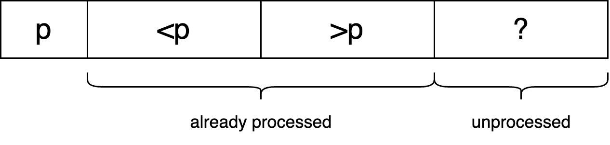
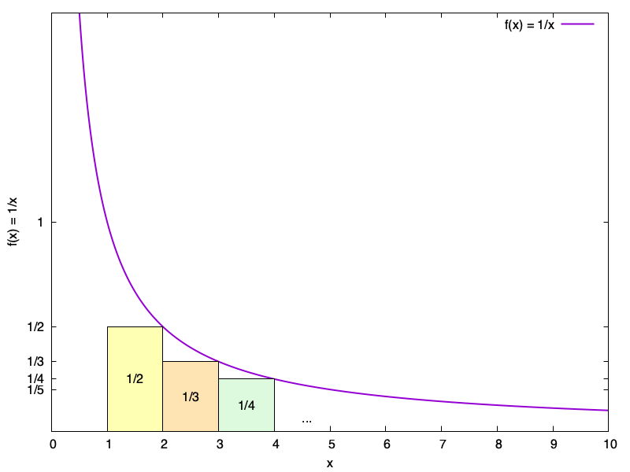

---
# Display h2 to h5 headings
toc_min_heading_level: 2
toc_max_heading_level: 5
---

# Quicksort

## 1. Introduction

Quicksort is competitive and often superior to other sorting algorithms such as mergesort. Unlike mergesort, quicksort sorts the elements **in-place**, meaning it operates on the input array through repeated swaps of pairs of elements, and therefore uses a very small amount of memory for intermediate computations.

## 2. Pseudocode

### 2-1 Quicksort

**Input:** array $A$ of $n$ distinct integers.

**Expected output:** elements in array $A$ are sorted in ascending order.

```jsx showLineNumbers
if (n <= 1) return // base case
Choose a pivot element p
Partition A around p
Recursively sort the first part of A
Recursively sort the second part of A
```

### 2-2 Partition subroutine

In the partition subroutine, the elements less than the pivot are moved to the left of the pivot and the elements bigger than the pivot are moved to the right of the pivot. After partitioning, the pivot element winds up in its rightful position. It should be implemented in-place and with next to no memory beyond that occupied by the input array.

The input array ends up like this after partition subroutine is done:


During the partition subroutine, it keeps the following 3 invariants so that the array is in the form of the diagram below:

1. The first element is the pivot element, which can be enforced in $O(1)$ time by swapping the first element with the pivot element in the preprocessing step.

2. Following the pivot element are the elements that were already processed. The elements less than the pivot precede the elements bigger than the pivot.

3. The rest are the elements that haven't been processed.





**Input:** 

1. $A$ of $n$ distinct integers. 
2. Left $l$ and right $r$ endpoints $l, r \in \{1,2,...,n\}$ with $l \le r$.

**Pseudocode:**

First, the we assign $\text{A[l]}$ as pivot element $p$ to maintain invariant 1.

To maintain the second and the third invariants, we use index $i$ to point to the boundary between the elements less than the pivot and elements bigger than the pivot and use index $j$ to point to the boundary between the processed and unprocessed elements. 

Both $i$ and $j$ are initialized to the boundary between the pivot element and the rest. Each iteration, a new element is processed and then $j$ is increased by 1 to maintain invariant 3. In addition, it may require additional work to maintain invariant 2. When $\text{A[j]}$ is less than the pivot, it should be swapped with the $\text{A[i]}$ since $i$ points to the leftmost element of the processed elements that are greater than the pivot. Then, $i$ is incremented by 1 to update the new boundary.

The final step is to place the pivot into its rightful position by swapping $\text{A[l]}$ with the rightmost element of elements less than the pivot $\text{A[i-1]}$ and then return this position back to the quicksort call.

```jsx showLineNumbers
p := A[l]
i := l+1
for j := l+1 to r do
    if A[j] < p  // Do nothing if A[j] > p
        swap A[j] and A[i]
        i := i+1
swap A[l] and A[i-1] // Place pivot correctly
return i-1
```

## 3. Performance Analysis

The performance of quicksort depends on how the pivot is chosen.

### 3-1 Worst-case scenario

If we always choose the 1st element in the input array as the pivot and the array is **already sorted**, the running time of quicksort would be $\Theta(n^2)$. In the outermost call to quicksort, the size of the array passed to the partition subroutine is $n$. Since the array is already sorted, the partition subroutine does nothing (i.e., no swaps occur). Therefore, the size of the left subarray is zero and the size of the right subarray is $n-1$, resulting in one empty recursive call and one recursive call that is passed a subarray of $n-1$ elements. This pattern recurs, so the partition subroutine is invoked on subarrays of length $n, n-1, ..., 2$. Since the work done by the partition subroutine is proportional to the length of the passed subarray, the total work done by the quicksort call is proportional to

$\underbrace{n + n-1 + ... + 2 + 1}_{\Theta(n^2)}$

, assuming the partition is invoked on a subarray of length 1 for simplicity.

### 3-2 Best-case scenario

If the chosen pivot is the **median** element, the number of elements on the left of the pivot is the same as the number of elements on the right of the pivot, and the array achieves a perfectly balanced split. Assuming the running time of choosing a pivot that is the median is $\Theta(n)$ (*see selection problem), the running time of quicksort would be $\Theta(n\log n)$.

Recall the master method, $T(n)$ denotes the running time of the quicksort call on an array of length $n$, and the work done outside the recursive calls is the work done by the partition and choose pivot subroutines.

$T(n) = \underbrace{2 \cdot T(\dfrac n 2)}_{\text {pivot is median}} + \underbrace{\Theta(n)}_{\text{choose pivot and partition}}$

By the master method, $T(n) = \Theta(n\log n)$ since $a=b=2$ and $d=1$.

### 3-3 Randomization

Always choosing the first element as the pivot takes $O(1)$ time, but it can cause the running time of quicksort to be $O(n^2)$. Choosing the median element as the pivot can guarantee $O(n\log n)$ running time of quicksort but it takes $O(n)$ time to get the median. Choosing the pivot using randomization (i.e., choosing the pivot uniformly at random) is not only more effective than choosing the median but also causes quicksort to run in $O(n\log n)$ time **on average**. Next, we will use mathematical analysis to show that the average running time of quicksort is $O(n\log n)$ when the pivot is chosen using randomization.

#### Mathematical analysis

:::tip[Hypothesis 1]
For every input array of length $n \ge 1$, the average running time of randomized quicksort is $O(n\log n)$.
:::

**Probability terminologies used:**

    - Random process: randomly choose a pivot on each quicksort recursive call.
    - Sample space $\Omega: $ all the outcomes of random choices in quicksort (i.e., all the pivot sequences).
    - Random variables:

        - $RT(w)$ is the number of primitive operations performed by randomized quicksort given a pivot sequence $w$, and it ranges from $\Theta(n\log n)$ to $\Theta(n^2)$.

        - $C(w)$ denotes the random variable that equals the number of comparisons between the pairs of input elements performed by quicksort with a given sequence of pivot choices. These comparisons occur in the partition subroutine only.

**Proving strategy:**
The comparisons dominate the running time of quicksort, meaning that the running time of quicksort is larger than the number of comparisons by a constant factor $a$. To prove an upper bound of $O(n\log n)$ on the running time of quicksort, we can prove an upper bound of $O(n\log n)$ on the number of comparisons instead.

$RT(w) \le a \cdot C(w)$

**Why does the number of comparisons dominate the running time of quicksort:**

The running time of **one** quicksort call can be decomposed into two parts – the work done outside the partition subroutine (choosing pivot) and the work of the partition subroutine.

- **Choosing pivot:**
    It is assumed that choosing the pivot counts as 1 operation, and therefore the operation outside the partition subroutine of a quicksort call is constant $O(1)$.

- **Partition:**
    The number of comparisons in a partition subroutine is linear in relation to the length of the subarray. To be more precise, the number of comparisons is the subarray length. By the inspection of the partition pseudocode, the number of operations per partition call is **at most** a constant times the subarray length $a_i \cdot n_i$ where $i$ denotes the $i$th partition call and $n_i$ denotes the subarray length which is also the number of comparisons.

Due to the recursive nature, there are at most $n$ subsequent recursive quicksort calls because each element of the input array can be chosen as the pivot only once before excluding it from the future recursive calls.

Hence, the total work done by choosing the pivot is $O(n)$, and the number of operations (total work) done by all the partition calls is **at most** $\sum\limits_{i=1}^{n} a_i \cdot n_i$.

Because the number of operations inside the `if` block is the same across all the partition calls, the value of $a_i$ is the same for all the $i$, and therefore we can factor out $a_i$ from the summation.

$a \cdot \sum\limits_{i=i}^{n} n_i = a \cdot C$.

Take a closer look at the summation term. It's the sum of the number of comparisons of all the partition calls. So, the total work done by all the partition calls is **at most** a constant times the total number of comparisons.

To sum up, the total number of operations $RT(w)$ is the sum of two parts, $O(n) + a \cdot C(w)$.

$C(w)$ is at least $O(n)$ since the first partition call has at least $n$ comparisons. Therefore, the $O(n)$ work done by choosing the pivot can be absorbed into the constant factor $a$ or it can be ignored since $C(w)$ may be $O(n\log n)$ or even $O(n^2)$ that dominates the total number of operations. Either way, it's proven that the number of comparisons dominates the running time of quicksort.

As a result, we can prove hypothesis 1 by proving hypothesis 2 instead.

:::tip[HYPOTHESIS 2]
For every input array of length $n \ge 1$, the expected number of comparisons between input array elements in randomized quickSort is at most $2(n − 1)\log n = O(n\log n)$.
:::

**Proving strategy:**

1. Express the complex random variable as the sum of simpler random variables.

    $ Y = \sum\limits_{l=1}^{m} X_l$

2. Utilize the property of linearity of expectation that the expectation of the sum of simpler random variables is the sum of expectations of random variables.

    $E[Y] = E[\sum\limits_{l=1}^{m} X_l] = \sum\limits_{l=1}^{m} E[X_l]$

3. Assuming that the simpler random variables are indicator random variables, the expectation of the indicator random variable can be simplify to the probability that the random variable takes on value 1.

    $E[X_{l}] = 1 \cdot Pr[X_{l} = 1] + \underbrace{0 \cdot Pr[X_{l} = 0]}_{\text{=0}} = Pr[X_{l} = 1]$

4. Combine the results from steps 2 and 3. The expectation of the complex random variable is the sum of the probabilities that the simpler random variables take on the value 1.

    $E[Y] = \sum\limits_{l=1}^{m} E[X_l] = \sum\limits_{l=1}^{m}Pr[X_l=1]$

**Apply the strategy:**

1. 
    The complex random variable, in this case, is the number of comparisons of quicksort $C(w)$. It can be decomposed into the number of comparisons of each pair of input array elements.

    Let $z_i$ denote the $i$th-smallest element in the input array (aka $i$th order statistic). For every pair of array indices $i, j \in \{1, 2, ..., n\}$ with $i < j$, we define $X_{ij}$ as the random variable that is the number of times elements $z_i$ and $z_j$ get compared in quicksort when pivots are specified by $w$. With this definition, we get:

    $C(w) = \sum\limits_{i=1}^{n-1}\sum\limits_{j=i+1}^{n}X_{ij}(w)$ for every $w \in\Omega$.

2. 
    $E[C]=E[\sum\limits_{i=1}^{n-1}\sum\limits_{j=i+1}^{n}X_{ij}]=\sum\limits_{i=1}^{n-1}\sum\limits_{j=i+1}^{n}E[X_{ij}]$

3.
    $X_{ij}$ is an indicator random variable because $z_i$ and $z_j$ are either compared once or not at all.

    $E[X_{ij}] = Pr[X_{ij}=1]$

    At the outermost quicksort call, there are four scenarios depending on the chosen pivot $z_k$:
    - $z_k$ is smaller than $z_i$. Both $z_i$ and $z_j$ are passed to the second recursive call.
    - $z_k$ is greater than $z_j$. Both $z_i$ and $z_j$ are passed to the first recursive call.
    - $z_k$ is between $z_i$ and $z_j$ ($i < k < j$). $z_i$ is passed to the first recursive call, and $z_j$ to the second one.
    - $z_k$ is either $z_i$ or $z_j$. The pivot is excluded from both recursive calls; the other element is passed to the first (if $k = j$) or second (if $k = i$) recursive call.

    In the first two scenarios, $z_i$ and $z_j$ are not compared and will continue to be passed to the same recursive call until scenario 3 or 4 occurs. In scenarios 3 and 4, $z_i$ and $z_j$ may be compared once or not at all, and that's why $X_{ij}$ is an indicator random variable.

    **Now the problem is narrowed down to finding the probability that $z_i$ and $z_j$ get compared.**

    It is claimed that:

    $Pr[z_i$ and $z_j$ get compared at some point in randomized quicksort$] = \dfrac{2} {j-i+1}$

    , which is independent of the array size $n$

    We can prove this claim by induction.[^1] 

    - **Base case**: When the array size $n = 2$, $z_i$ and $z_j$ must get compared with probability $1$ since either of them will be chosen as the pivot at the outermost quicksort call. According to the claim, the probability is computed as: $\dfrac{2}{j-i+1}=\dfrac{2}{2}=1$. Thus, the statement holds for the base case.

    - **Inductive hypothesis**: Assuming that the statement holds for an array of size $k > 2$. In other words, the probability is independent of the size of the array.

    - **Inductive step**: For an array of size $n \gt k$, the probability of $z_i$ and $z_j$ getting compared equals the sum of the probability that either $z_i$ or $z_j$ is chosen as the pivot at the outermost quicksort call, and the probability that a pivot less than $z_i$ or greater than $z_j$ is chosen at the first quicksort call times the probability that $z_i$ and $z_j$ are compared in a smaller subarray of size $k$.

        $Pr[z_i$ and $z_j$ get compared$] = \dfrac{2}{n}  + \underbrace{\dfrac{n-(j-i+1)}{n}}_{\text{probability that the pivot is not one of } z_i {\text{ to }} z_j}\cdot\underbrace{\dfrac{2}{j-i+1}}_{\text{by inductive hypothesis}}$

        $= \dfrac{\cancel{2\cdot(j-i+1)}}{n \cdot (j-i+1)}  + \dfrac{2\cdot n-\cancel{2\cdot(j-i+1)}}{n \cdot (j-i+1)}$

        $= \dfrac{{2}\cdot \cancel{n}}{\cancel{n} \cdot (j-i+1)}$

        $= \dfrac{2}{j-i+1}$

        The claim holds in the inductive step, and therefore it's proven that the probability of $z_i$ and $z_j$ getting compared is indeed  $\dfrac{2}{j-i+1}$.
4.
    Put the result of point 3 into the formula, we get:

    $E[C] = \sum\limits_{i=1}^{n-1}\sum\limits_{j=i+1}^{n}E[X_{ij}] = \sum\limits_{i=1}^{n-1}\sum\limits_{j=i+1}^{n}Pr[X_{ij} = 1] = \sum\limits_{i=1}^{n-1}\sum\limits_{j=i+1}^{n}\dfrac{2}{j-i+1}$

    For a fixed value of $i$, the inner sum has at most n-1 terms.

    $\sum\limits_{j=i+1}^{n}\dfrac{2}{j-i+1} = 2\underbrace{\cdot(\dfrac{1}{2}+\dfrac{1}{3}+...+\dfrac{1}{n-i+1})}_{\text{at most n-1 terms}}$

    Among all the $i$, the largest inner sum occurs when $i = 1$ since it generates most terms (n-1 terms).
    
    $\text{Largest inner sum} = \sum\limits_{j=2}^{n}\dfrac{2}{j} = 2\underbrace{\cdot(\dfrac{1}{2}+\dfrac{1}{3}+...+\dfrac{1}{n})}_{\text{n-1 terms}}$

    , which is independent of $i$.
    
    We can bound each inner sum with this value and get:

    $\sum\limits_{i=1}^{n-1}\sum\limits_{j=i+1}^{n}\dfrac{2}{j-i+1} \le \sum\limits_{i=1}^{n-1}\sum\limits_{j=2}^{n}\dfrac{2}{j} = 2(n-1)\sum\limits_{j=2}^{n}\dfrac{1}{j}$

    The value of $\sum\limits_{j=2}^{n}\dfrac{1}{j}$ can be bounded by the integral of $1/x$ from $x=1$ to $x=n$. As the diagram shown, the sum corresponding to the area of the rectangles is bounded by the area under the curve.
    
    

    $\sum\limits_{j=2}^{n}\dfrac{1}{j} \le \int_{1}^{n}\dfrac{1}{x}\,dx = \ln\,x|_1^n = \ln n - \ln1 = \ln n$

    $\sum\limits_{i=1}^{n-1}\sum\limits_{j=i+1}^{n}\dfrac{2}{j-i+1} \le \sum\limits_{i=1}^{n-1}\sum\limits_{j=2}^{n}\dfrac{2}{j} = 2(n-1)\sum\limits_{j=2}^{n}\dfrac{1}{j} \le 2(n-1)\ln n$

    Hence, the expected number of comparisons and the running time of randomized quicksort is $O(n\log n)$.

## 4. Implementation

[Code snippet](https://github.com/Fan-55/Algorithms/blob/main/src/Quick.java)

```jsx showLineNumbers
import edu.princeton.cs.algs4.StdRandom;

public class Quick {
  public static void sort(Comparable[] a) {
    StdRandom.shuffle(a);
    sort(a, 0, a.length - 1);
  }

  private static void sort(Comparable[] a, int lo, int hi) {
    if (lo >= hi) return;
    int j = partition2(a, lo, hi);
    sort(a, lo, j-1);
    sort(a, j+1, hi);
  }

  /// This is implemented based on Tim Roughgarden's pseudocode
  private static int partition1(Comparable[] a, int lo, int hi) {
    int i = lo + 1;
    Comparable pivot = a[lo];
    for (int j = lo + 1; j <= hi; j++) {
      if (less(a[j], pivot)) {
        /// swap a[j] and a[i]
        Comparable temp = a[j];
        a[j] = a[i];
        a[i] = temp;
        i++;
      }
    }
    /// Move pivot to its rightful place (i - 1)
    Comparable temp = a[i - 1];
    a[i - 1] = pivot;
    a[lo] = temp;
    return i - 1;
  }

  /// This is Robert Sedgewick's version of partition
  private static int partition2(Comparable[] a, int lo, int hi) {
    int i = lo + 1;
    int j = hi;
    Comparable pivot = a[lo];
    while(true) {
      while(less(a[i], pivot)) {
        i++;
        if (i == hi) break;
      }
      while(less(pivot, a[j])) {
        j--;
        if (j == lo + 1) break;
      }
      if (i >= j) break;
      swap(a, i, j);
    }
    swap(a, lo, j);
    return j;
  }

  private static void swap(Comparable[] a, int i, int j) {
    Comparable temp = a[i];
    a[i] = a[j];
    a[j] = temp;
  }

  private static boolean less(Comparable a, Comparable b) {
    return a.compareTo(b) < 0;
  }

  public static void main(String[] args) {
    Comparable<Integer>[] a = new Comparable[]{5, 8, 11, 9, 2, 18};
    sort(a);
    for (Comparable<Integer> ele: a) {
      System.out.println(ele);
    }
  }
}

```


[^1]: https://cs.stackexchange.com/a/123650
